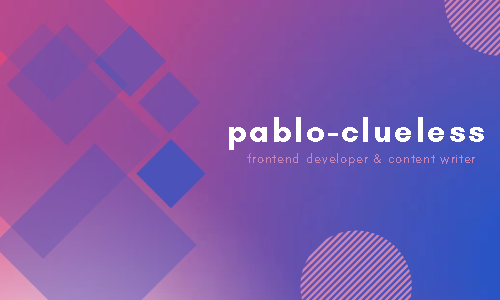

# 
Hi there  

   

I'm a self-taught Frontend Web Developer and Blockchain enthusiast based in Lagos, Nigeria. I love minimalist & cool designs and animations. I spend most of my time either writing new codes or reviewing previous ones, adhering to real applications implementation with the knowledge and understanding of web development concepts. I like looking for solutions and creating a great user experience. I've worked with other developers on projects and created several working SPAs and websites that are maintainable and scalable. I like pop music and good food. When I'm not coding, I'm either reading, playing video games or writing. If you need a developer to jump on a challenging and interesting project, I'm just a click away.

   

<!-- |||
|:------------------------------------------------------------------------:|:------------------------------------------------------------------------------:| -->

## Tools I use

## Contact

# I write on Hashnode

# Checkout useful code examples and snippets

